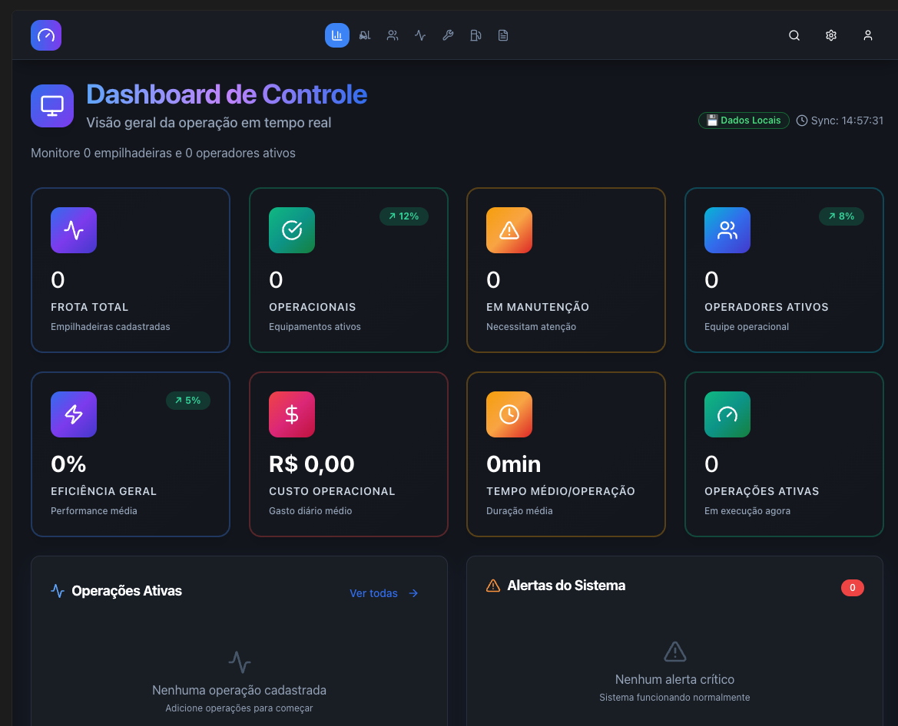

## Overview

The is a responsive web based TODO application where each user logs in to create a list of TODO's via a rich UI.

Each TODO list starts off with a name provided by the user. Once all TODO items have been completed, the TODO list moves from the ACTIVE list of TODO's to a COMPLETED (OR ARCHIVED) list of TODO's which the can refer to at any time.

TODO's should be persisted to the database behind the scenes without the user having to actively click a Save button (or something similar).

##\ FEATURE Checklist

# Design

You **MUST** refer to  for the general theme that should be followed when building the web pages and UI components.

# In Progress

Features here should be implemented and an update with [X] to indicate the feature has been implemented:

- [x] User is able Login (using OAuth/JWT) via Google Login and is redirected to the todo page/dashboard (empty for now) which will contain a list of Active TODO's and completed TODO lists.
- [x] User is able to Logout and is redirected to Signin Page.
- [x] Logged in user is able to create and name a new TODO list.
- [x] Logged in user is able to view todo items for a particular TODO list

# Planned

Features are expected to be implemented in the future but should not be implemented until they are moved to the In Progress list.

- [ ] Logged in User is able add TODO items to the list.
- [ ] Logged in User is able remove TODO items from the list.
- [ ] Logged in User is able complete TODO items in the list.
- [ ] Logged in User is able delete TODO lists.
- [ ] Logged in User is able view Active TODO lists from the main/home page.
- [ ] Logged in User is able view Completed TODO lists from the main/home page.
- [ ] Logged in User is able filter TODO list from the main/home page for easier searching.

- [ ] Add deadlines to certain TODO items.
- [ ] Send notifications via x days/hours before the TODO item's deadline date. the notification days/hour trigger should be configurable via a users settings page.
- [ ] Add observability i.e. loggging/tracing/metrics.
- [ ] Extend support for mobile native iOS/Android
